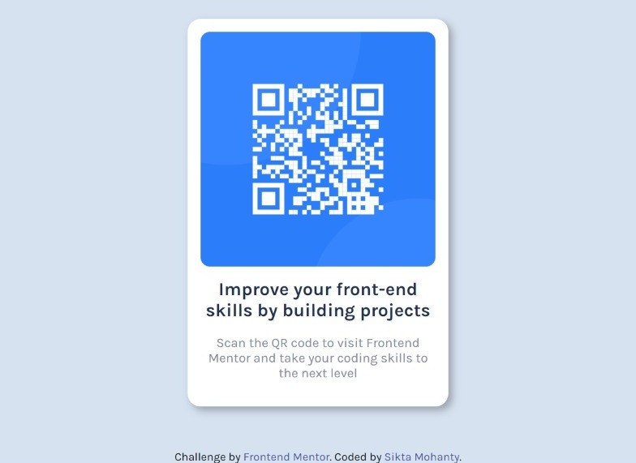

# Frontend Mentor - QR code component solution

This is a solution to the [QR code component challenge on Frontend Mentor](https://www.frontendmentor.io/challenges/qr-code-component-iux_sIO_H). Frontend Mentor challenges help you improve your coding skills by building realistic projects. 

## Table of contents

- [Overview](#overview)
  - [Screenshot](#screenshot)
  - [Links](#links)
  - [Built with](#built-with)
- [Author](#author)

## Overview

**Challenge is to build out this QR-Card component and get it looking as close to the design as possible.**

### Screenshot

### Links

- Solution URL: [Add solution URL here](https://your-solution-url.com)
- Live Site URL: [Add live site URL here](https://sikta2002.github.io/QR-Code-Component/)

### Built with

- Semantic HTML5 markup
- CSS custom properties
- Flexbox
- CSS Grid

## Author

- Website - [Sikta Mohanty](https://github.com/Sikta2002)
- Frontend Mentor - [@Sikta2002](https://www.frontendmentor.io/profile/Sikta2002)
- Twitter - [@moonsikta](https://twitter.com/moonsikta)
